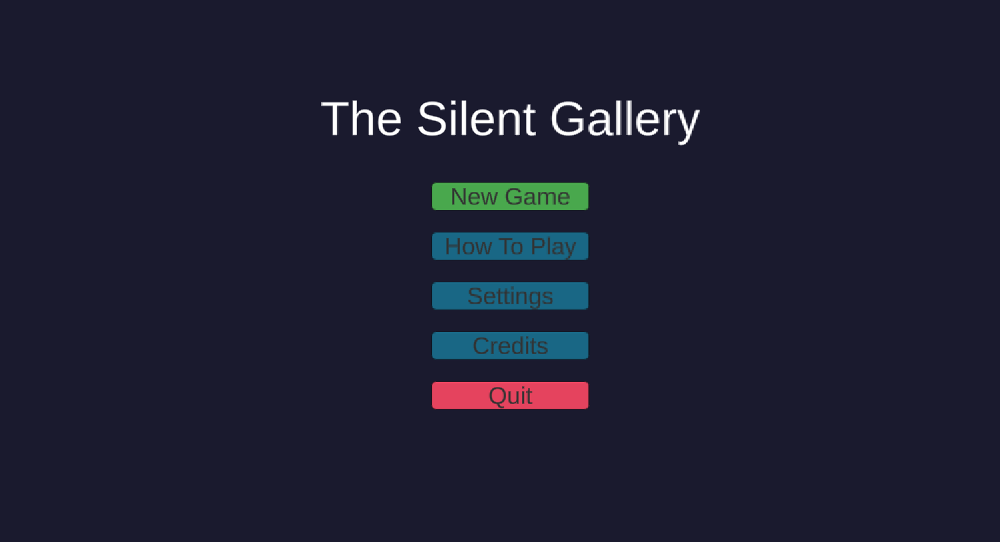
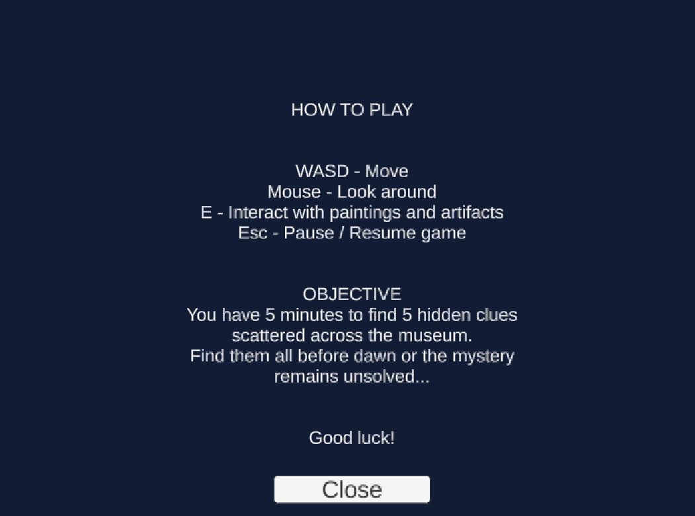
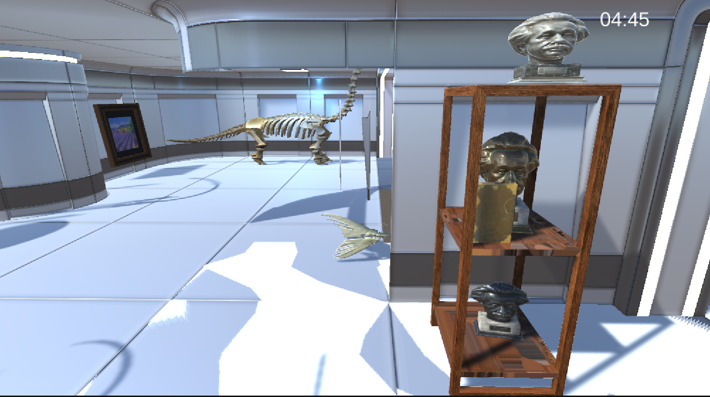
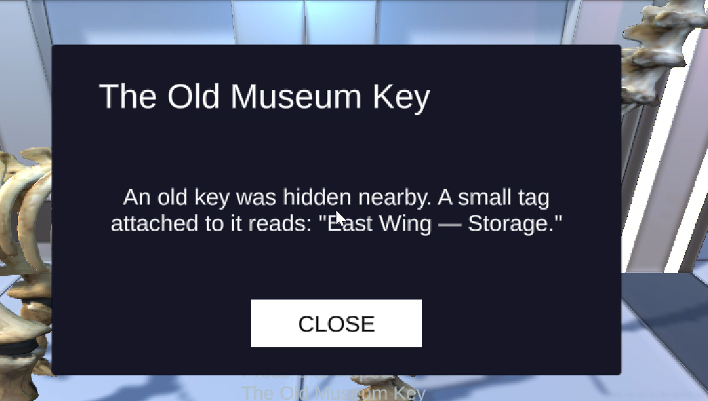
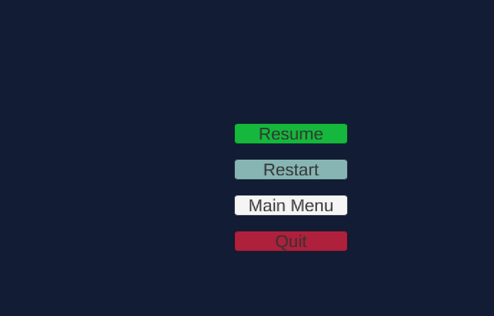
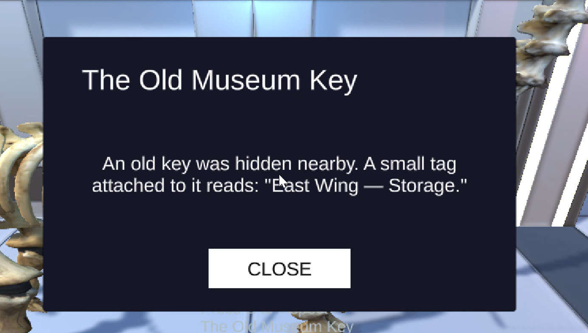
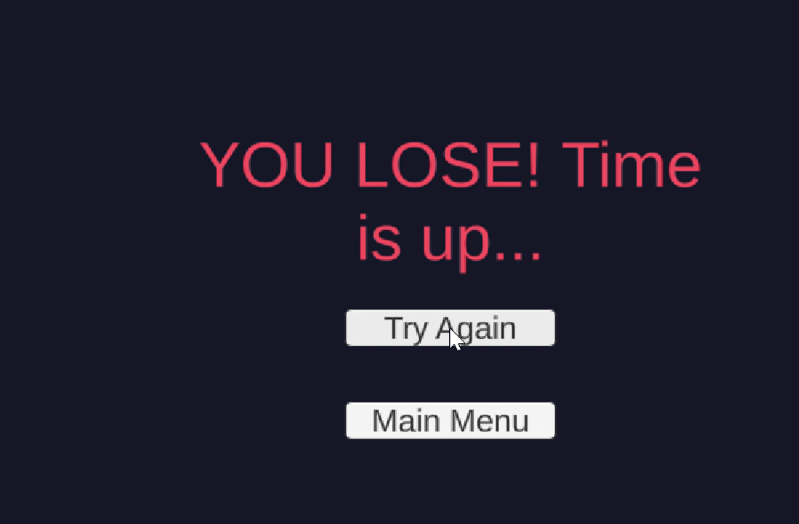

Welcome. This document provides essential information about the game, including how to play, game mechanics, controls, and additional notes.

## Team Group H

**Game Name:** The Silent Gallery

**Participants:**
- Fatima Abu Abed
- Marwa Hoshia
- Hiba Abdo
- Haneen Shqerat

## Table of Contents

- [Game Overview](#game-overview)
- [Credits](#credits)
- [How to Play](#how-to-play)
- [Controls](#controls)
- [Objectives & Goals](#objectives--goals)
- [Game Mechanics & Features](#game-mechanics--features)
- [System Requirements](#system-requirements)
- [Known Issues & Troubleshooting](#known-issues--troubleshooting)
- [Additional Notes](#additional-notes)
- [Media](#media)

## Game Overview

**Genre:** First-person mystery / exploration

**Platform:** Windows

**Team:** Fatima Abu Abed, Marwa Hoshia, Hiba Abdo, Haneen Shqerat

The player wakes up locked inside a museum gallery after closing time. Something happened here, and the only way out is to piece together what — five clues are hidden among the exhibits: a torn letter, a smudged painting, a curator's ledger, a Greek statue, and an old museum key. Explore the gallery, interact with the paintings and artifacts, and find them all before dawn — or the mystery remains unsolved.

## Credits

Third-party environment and prop assets used, under their respective licenses, for educational, non-commercial coursework use:

- 3D Free Modular Kit — Barking_Dog
- Greek Statue
- Oil Paintings — PolyKebap
- Bust of Sappho, Owl Statue — AK Studio Art
- Ancient Pots
- Books pack
- Free Statue Pack
- Concrete Bench — H&L Assets
- Furniture (Bandaji, folding screens, tables) — KCDF

## How to Play

**Starting the Game:** Open the project in Unity 2022.3.62f3, open `Assets/MainMenu.unity`, and press Play — or run a built `.exe`, which starts at the Main Menu automatically. From the Main Menu, select **New Game** to begin.

**Gameplay Basics:** You start inside the gallery with a 5-minute countdown already running (shown top-right of the screen). Walk around, look at the exhibits, and press **E** whenever a "Press E to inspect..." prompt appears to reveal a clue. Each clue opens a popup with its title and text, then closes automatically, or via the on-screen Close button.

**Levels/Stages:** The game has a single gameplay scene (the Gallery). There are no separate levels — the whole objective is contained within one continuous playthrough.

## Controls

| Action | Input |
|---|---|
| Move | `W` `A` `S` `D` |
| Look around | Mouse |
| Interact with paintings and artifacts | `E` |
| Pause / Resume | `Esc` |

## Objectives & Goals

**Main Objective:** Find all 5 hidden clues scattered across the museum before the 5-minute timer runs out.

**Secondary Goals:** None beyond the main objective — the clue texts build a small narrative as you find them, but there's no separate scoring or optional content.

## Game Mechanics & Features

- **Clue Reveal System:** Interactable exhibits hold clue data (title + text). Finding a new clue shows a popup and counts toward the win condition; already-found clues can be re-inspected without double-counting.
- **Interaction System:** A camera raycast detects nearby interactable objects and shows a context-sensitive prompt before you interact.
- **Countdown Timer:** A 5-minute timer runs from the moment gameplay starts, shown top-right of the screen, and drives the lose condition if it reaches zero first.
- **Win / Lose End Screen:** Finding all 5 clues before time runs out shows "YOU WIN! All clues found!"; the timer expiring first shows "YOU LOSE! Time is up...". Both offer a restart button and a return to Main Menu.
- **Pause Menu:** `Esc` opens a pause overlay (Resume / Restart / Main Menu / Quit) and freezes gameplay time without exiting the scene.

## System Requirements

**Minimum Requirements:**
- OS: Windows 10 or later
- Processor: Any dual-core CPU from the last decade
- Memory: 4 GB RAM
- Graphics: Any GPU with DX11 support (integrated graphics is sufficient)
- Storage: ~1 GB free space

**Recommended Requirements:**
- OS: Windows 10/11
- Processor: Quad-core CPU
- Memory: 8 GB RAM
- Graphics: Dedicated GPU
- Storage: ~1 GB free space

## Known Issues & Troubleshooting

- **Main Menu doesn't appear when pressing Play in the Unity Editor:** Play mode runs whichever scene is currently open in the Editor, not necessarily the first Build Settings scene. Open `Assets/MainMenu.unity` before pressing Play. This does not affect built `.exe` versions, which always start at the Main Menu correctly.
- **Settings panel is a placeholder:** The Settings screen (Main Menu) currently has no functional options.

## Additional Notes

**Game Version:** Submission build, August 2026

**Last Update:** See the repository's commit history for the most recent changes.

**Contact Information:** Reach out to any team member listed above via the course's usual channels for bug reports or feedback.

## Media

**Gameplay video:** [Watch on YouTube](https://youtu.be/twJdEOO1994)

**Screenshots:**

| Main Menu | How to Play |
|---|---|
|  |  |

| Gameplay | Clue Popup |
|---|---|
|  |  |

| Pause Menu | Win Screen | Lose Screen |
|---|---|---|
|  |  |  |
